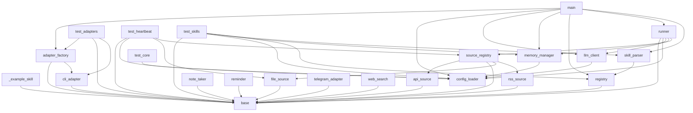

# Project Context

> **Auto-generated by [code-mapper](https://github.com/your-org/code-mapper).**  
> Read this file instead of scanning source files — it captures the full structure at a fraction of the token cost.
> `A_OpenClaw` · 31 files (python×31) · 36 classes · 10 functions · ~2,663 source lines

---
## File Structure

```
A_OpenClaw/
├── adapters/
  └── __init__.py
  └── adapter_factory.py
  └── base.py
  └── cli_adapter.py
  └── telegram_adapter.py
├── core/
  └── __init__.py
  └── config_loader.py
  └── llm_client.py
  └── memory_manager.py
├── custom_skills/
  └── _example_skill.py
├── heartbeat/
  └── __init__.py
  └── runner.py
  └── source_registry.py
  ├── sources/
    └── __init__.py
    └── api_source.py
    └── base.py
    └── file_source.py
    └── rss_source.py
└── main.py
├── skills/
  └── __init__.py
  └── base.py
  └── note_taker.py
  └── registry.py
  └── reminder.py
  └── skill_parser.py
  └── web_search.py
├── tests/
  └── __init__.py
  └── test_adapters.py
  └── test_core.py
  └── test_heartbeat.py
  └── test_skills.py
```

## Class Diagram

```mermaid
classDiagram
    class APISource["APISource"] {
        +gather()
    }
    BaseSource <|-- APISource : extends
    class BaseAdapter["«abstract» BaseAdapter"] {
        +on_message()
        +start()
        +stop()
        +send()
        +is_allowed()
        +__init__()
    }
    class BaseSkill["«abstract» BaseSkill"] {
        +name: str
        +description: str
        +parameters: dict
        +execute()
    }
    class BaseSource["«abstract» BaseSource"] {
        +gather()
        +__init__()
    }
    class CLIAdapter["CLIAdapter"] {
        +start()
        +stop()
        +send()
        +__init__()
    }
    BaseAdapter <|-- CLIAdapter : extends
    class DummyAdapter["DummyAdapter"] {
        +start()
        +stop()
        +send()
        +__init__()
    }
    BaseAdapter <|-- DummyAdapter : extends
    class EchoSkill["EchoSkill"] {
        +execute()
    }
    BaseSkill <|-- EchoSkill : extends
    class FileSource["FileSource"] {
        +gather()
    }
    BaseSource <|-- FileSource : extends
    class HeartbeatRunner["HeartbeatRunner"] {
        +set_adapter()
        +gather_all()
        +process()
        +execute_actions()
        +tick()
        +run_once()
        +run_loop()
        ...
    }
    class HelloSkill["HelloSkill"] {
        +execute()
    }
    BaseSkill <|-- HelloSkill : extends
    class LLMClient["LLMClient"] {
        +send()
        +__init__()
    }
    class MemoryManager["MemoryManager"] {
        +read_memory()
        +write_memory()
        +append_memory()
        +build_context()
        +compact_memory()
        +log_interaction()
        +__init__()
    }
    class NoteTakerSkill["NoteTakerSkill"] {
        +execute()
    }
    BaseSkill <|-- NoteTakerSkill : extends
    class RSSSource["RSSSource"] {
        +gather()
    }
    BaseSource <|-- RSSSource : extends
    class ReminderSkill["ReminderSkill"] {
        +execute()
    }
    BaseSkill <|-- ReminderSkill : extends
    class SkillRegistry["SkillRegistry"] {
        +register()
        +unregister()
        +get()
        +list_skills()
        +invoke()
        +auto_discover()
        +generate_skill_md()
        ...
    }
    class TelegramAdapter["TelegramAdapter"] {
        +start()
        +start_background()
        +stop()
        +send()
        +__init__()
    }
    BaseAdapter <|-- TelegramAdapter : extends
    class TestAPISource["TestAPISource"] {
        +test_empty_url()
        +test_successful_fetch()
    }
    class TestAdapterFactory["TestAdapterFactory"] {
        +test_default_to_cli()
        +test_explicit_cli()
        +test_no_adapter_section()
        +test_unknown_type_raises()
        +test_register_custom_adapter()
        +test_telegram_lazy_import()
    }
    class TestAdapterHeartbeatIntegration["TestAdapterHeartbeatIntegration"] {
        +test_heartbeat_sends_through_adapter()
        +test_heartbeat_no_adapter_no_crash()
    }
    class TestBaseAdapter["TestBaseAdapter"] {
        +test_on_message_registers_handler()
        +test_send_records_message()
        +test_start_stop()
        +test_is_allowed_empty_allowlist()
        +test_is_allowed_no_allowlist_key()
        +test_is_allowed_with_allowlist()
        +test_name_and_config()
    }
    class TestCLIAdapter["TestCLIAdapter"] {
        +test_init_defaults()
        +test_send_prints_to_stdout()
        +test_stop_sets_running_false()
        +test_start_no_handler_prints_warning()
        +test_start_with_handler()
        +test_start_exits_on_eof()
        +test_start_exits_on_keyboard_interrupt()
        ...
    }
    class TestConfigLoader["TestConfigLoader"] {
        +test_loads_default_config()
        +test_env_override()
        +test_missing_config_file_returns_empty()
    }
    class TestConfigValidation["TestConfigValidation"] {
        +test_valid_config()
        +test_invalid_provider()
        +test_invalid_max_tokens()
        +test_invalid_heartbeat_interval()
        +test_invalid_log_format()
        +test_source_missing_type()
    }
    class TestFileSource["TestFileSource"] {
        +test_gather_directory()
        +test_gather_missing_path()
        +test_gather_single_file()
        +test_gather_empty_dir()
    }
    class TestHeartbeatRunner["TestHeartbeatRunner"] {
        +test_init_no_sources()
        +test_init_with_file_source()
        +test_gather_all_empty()
        +test_gather_all_with_source()
        +test_process_empty_data()
        +test_set_adapter()
        +test_stop_event()
    }
    class TestLLMClient["TestLLMClient"] {
        +test_init_defaults()
        +test_ollama_defaults()
        +test_llamacpp_defaults()
        +test_unknown_provider_raises_on_get_client()
        +test_missing_api_key_raises()
    }
    class TestMemoryManager["TestMemoryManager"] {
        +setUp()
        +test_read_write_memory()
        +test_append_memory()
        +test_unknown_key_raises()
        +test_build_context()
        +test_log_interaction()
        +test_compact_memory_noop_when_small()
        ...
    }
    class TestMessageHandlerFlow["TestMessageHandlerFlow"] {
        +test_handler_receives_correct_args()
        +test_handler_return_value_is_response()
    }
    class TestNoteTakerSkill["TestNoteTakerSkill"] {
        +setUp()
        +test_save_and_list()
        +test_save_no_content()
        +test_no_memory_manager()
    }
    class TestRSSSource["TestRSSSource"] {
        +test_empty_url()
    }
    class TestReminderSkill["TestReminderSkill"] {
        +setUp()
        +test_set_and_list()
        +test_check_due()
        +test_invalid_date()
        +test_no_text()
    }
    class TestSkillParser["TestSkillParser"] {
        +test_extract_single_call()
        +test_extract_multiple_calls()
        +test_extract_no_calls()
        +test_extract_invalid_json()
        +test_process_replaces_block()
        +test_process_chaining()
        +test_process_max_rounds()
    }
    class TestSkillRegistry["TestSkillRegistry"] {
        +test_register_and_invoke()
        +test_list_skills()
        +test_invoke_unknown_skill()
        +test_unregister()
        +test_auto_discover()
        +test_generate_skill_md()
        +test_generate_skill_md_empty()
        ...
    }
    class TestSourceRegistry["TestSourceRegistry"] {
        +test_create_file_source()
        +test_create_unknown_type_raises()
        +test_register_custom_source()
    }
    class WebSearchSkill["WebSearchSkill"] {
        +execute()
    }
    BaseSkill <|-- WebSearchSkill : extends
```



## Module Dependencies



## Symbol Index


**`adapters/adapter_factory.py`** `python`
> Factory that creates the right adapter from config.
- `def create_adapter(config: dict) → BaseAdapter`  — Create an adapter instance from the app config.
- `def register_adapter_type(type_name: str) → None`  — Register a custom adapter type.

**`adapters/base.py`** `python`
> Base adapter interface for channel adapters.
- `«abstract» class BaseAdapter(ABC)`  — Interface that all channel adapters must implement.
  methods: `on_message`, `start`, `stop`, `send`, `is_allowed`

**`adapters/cli_adapter.py`** `python`
> CLI adapter — interactive terminal interface.
- `class CLIAdapter(BaseAdapter)`  — Interactive command-line adapter.
  methods: `start`, `stop`, `send`

**`adapters/telegram_adapter.py`** `python`
> Telegram adapter — uses python-telegram-bot library.
- `class TelegramAdapter(BaseAdapter)`  — Telegram bot adapter using python-telegram-bot.
  methods: `start`, `start_background`, `stop`, `send`

**`core/config_loader.py`** `python`
> Configuration loader for A_OpenClaw.
- `def load_config(config_path) → dict`  — Load and merge configuration.
- `def validate_config(config: dict) → list`  — Validate configuration and return a list of error messages.
- `def resolve_path(config: dict, key: str) → Path`  — Resolve a config path relative to the project root.

**`core/llm_client.py`** `python`
> LLM API wrapper for A_OpenClaw.
- `class LLMClient`
  methods: `send`

**`core/memory_manager.py`** `python`
> File-based memory system for A_OpenClaw.
- `class MemoryManager`
  methods: `read_memory`, `write_memory`, `append_memory`, `build_context`, `compact_memory`, `log_interaction`

**`custom_skills/_example_skill.py`** `python`
> Example custom skill — copy and rename this file to create your own.
- `class HelloSkill(BaseSkill)`
  methods: `execute`

**`heartbeat/runner.py`** `python`
> Heartbeat engine — scheduled data gathering and LLM processing.
- `class HeartbeatRunner`
  methods: `set_adapter`, `gather_all`, `process`, `execute_actions`, `tick`, `run_once`, `run_loop`, `start_background`, +1 more

**`heartbeat/source_registry.py`** `python`
> Registry that maps source type names to their classes.
- `def create_source(source_config: dict) → BaseSource`  — Create a source instance from a config dict.
- `def register_source_type(type_name: str) → None`  — Register a custom source type.

**`heartbeat/sources/api_source.py`** `python`
> REST API data source for the heartbeat.
- `class APISource(BaseSource)`  — Fetch data from a REST API endpoint.
  methods: `gather`

**`heartbeat/sources/base.py`** `python`
> Base interface for heartbeat data sources.
- `«abstract» class BaseSource(ABC)`  — A data source that the heartbeat gathers information from.
  methods: `gather`

**`heartbeat/sources/file_source.py`** `python`
> Local file/directory data source for the heartbeat.
- `class FileSource(BaseSource)`  — Read local files or detect changes in a directory.
  methods: `gather`

**`heartbeat/sources/rss_source.py`** `python`
> RSS/Atom feed data source for the heartbeat.
- `class RSSSource(BaseSource)`  — Parse an RSS or Atom feed and return recent entries.
  methods: `gather`

**`main.py`** `python`
> A_OpenClaw — Entry point.
- `def main()`

**`skills/base.py`** `python`
> Base interface for skills.
- `«abstract» class BaseSkill(ABC)`  — A skill that the LLM can invoke to perform an action.
  methods: `execute`

**`skills/note_taker.py`** `python`
> Note taker skill — save and retrieve notes in memory.
- `class NoteTakerSkill(BaseSkill)`
  methods: `execute`

**`skills/registry.py`** `python`
> Skill registry — discovers, registers, and invokes skills.
- `class SkillRegistry`
  methods: `register`, `unregister`, `get`, `list_skills`, `invoke`, `auto_discover`, `generate_skill_md`, `update_skill_memory`

**`skills/reminder.py`** `python`
> Reminder skill — set and check reminders stored in memory.
- `class ReminderSkill(BaseSkill)`
  methods: `execute`

**`skills/skill_parser.py`** `python`
> Parse LLM responses for skill invocation blocks.
- `def extract_skill_calls(text: str) → list`  — Extract skill invocation blocks from LLM response text.
- `def process_skill_calls(response: str, registry: SkillRegistry, context, max_rounds: int) → str`  — Process all skill invocation blocks in an LLM response.

**`skills/web_search.py`** `python`
> Web search skill — search the web and return results.
- `class WebSearchSkill(BaseSkill)`
  methods: `execute`

**`tests/test_adapters.py`** `python`
> Tests for the adapter system.
- `class DummyAdapter(BaseAdapter)`  — Minimal concrete adapter for testing the base interface.
  methods: `start`, `stop`, `send`
- `class TestBaseAdapter(TestCase)`  — Tests for the BaseAdapter interface.
  methods: `test_on_message_registers_handler`, `test_send_records_message`, `test_start_stop`, `test_is_allowed_empty_allowlist`, `test_is_allowed_no_allowlist_key`, `test_is_allowed_with_allowlist`, `test_name_and_config`
- `class TestCLIAdapter(TestCase)`  — Tests for the CLI adapter.
  methods: `test_init_defaults`, `test_send_prints_to_stdout`, `test_stop_sets_running_false`, `test_start_no_handler_prints_warning`, `test_start_with_handler`, `test_start_exits_on_eof`, `test_start_exits_on_keyboard_interrupt`, `test_start_exits_on_empty_input`, +1 more
- `class TestAdapterFactory(TestCase)`  — Tests for the adapter factory.
  methods: `test_default_to_cli`, `test_explicit_cli`, `test_no_adapter_section`, `test_unknown_type_raises`, `test_register_custom_adapter`, `test_telegram_lazy_import`
- `class TestAdapterHeartbeatIntegration(TestCase)`  — Tests that heartbeat outbound messages route through the adapter.
  methods: `test_heartbeat_sends_through_adapter`, `test_heartbeat_no_adapter_no_crash`
- `class TestMessageHandlerFlow(TestCase)`  — Tests for the full message flow: adapter -> handler -> response.
  methods: `test_handler_receives_correct_args`, `test_handler_return_value_is_response`

**`tests/test_core.py`** `python`
> Tests for core components: config loader, memory manager, LLM client.
- `class TestConfigLoader(TestCase)`
  methods: `test_loads_default_config`, `test_env_override`, `test_missing_config_file_returns_empty`
- `class TestConfigValidation(TestCase)`
  methods: `test_valid_config`, `test_invalid_provider`, `test_invalid_max_tokens`, `test_invalid_heartbeat_interval`, `test_invalid_log_format`, `test_source_missing_type`
- `class TestMemoryManager(TestCase)`
  methods: `setUp`, `test_read_write_memory`, `test_append_memory`, `test_unknown_key_raises`, `test_build_context`, `test_log_interaction`, `test_compact_memory_noop_when_small`, `test_compact_memory_trims_when_large`, +1 more
- `class TestLLMClient(TestCase)`
  methods: `test_init_defaults`, `test_ollama_defaults`, `test_llamacpp_defaults`, `test_unknown_provider_raises_on_get_client`, `test_missing_api_key_raises`

**`tests/test_heartbeat.py`** `python`
> Tests for the heartbeat engine and data sources.
- `class TestSourceRegistry(TestCase)`
  methods: `test_create_file_source`, `test_create_unknown_type_raises`, `test_register_custom_source`
- `class TestFileSource(TestCase)`
  methods: `test_gather_directory`, `test_gather_missing_path`, `test_gather_single_file`, `test_gather_empty_dir`
- `class TestAPISource(TestCase)`
  methods: `test_empty_url`, `test_successful_fetch`
- `class TestRSSSource(TestCase)`
  methods: `test_empty_url`
- `class TestHeartbeatRunner(TestCase)`
  methods: `test_init_no_sources`, `test_init_with_file_source`, `test_gather_all_empty`, `test_gather_all_with_source`, `test_process_empty_data`, `test_set_adapter`, `test_stop_event`

**`tests/test_skills.py`** `python`
> Tests for the skills system: registry, parser, and built-in skills.
- `class EchoSkill(BaseSkill)`
  methods: `execute`
- `class TestSkillRegistry(TestCase)`
  methods: `test_register_and_invoke`, `test_list_skills`, `test_invoke_unknown_skill`, `test_unregister`, `test_auto_discover`, `test_generate_skill_md`, `test_generate_skill_md_empty`, `test_skill_execution_error`, +1 more
- `class TestSkillParser(TestCase)`
  methods: `test_extract_single_call`, `test_extract_multiple_calls`, `test_extract_no_calls`, `test_extract_invalid_json`, `test_process_replaces_block`, `test_process_chaining`, `test_process_max_rounds`
- `class TestNoteTakerSkill(TestCase)`
  methods: `setUp`, `test_save_and_list`, `test_save_no_content`, `test_no_memory_manager`
- `class TestReminderSkill(TestCase)`
  methods: `setUp`, `test_set_and_list`, `test_check_due`, `test_invalid_date`, `test_no_text`