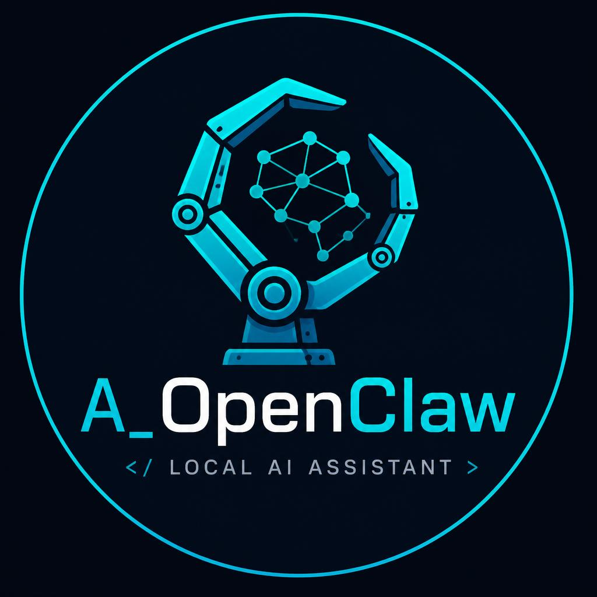

# A_OpenClaw



A lightweight, Python-based personal AI assistant inspired by [OpenClaw](https://github.com/openclaw/openclaw). It runs locally, connects to messaging platforms, gathers data on a schedule, and invokes custom skills — all orchestrated through an LLM.

## Features

- **Multi-provider LLM support** — Anthropic, OpenAI, Ollama (local), llama.cpp (local)
- **File-based memory** — Markdown files for user profile, knowledge base, skills, and interaction logs
- **Heartbeat engine** — Scheduled data gathering from APIs, files, and RSS feeds, processed by the LLM
- **Channel adapters** — CLI (default) and Telegram, with a factory pattern for adding more
- **Skills system** — Auto-discovering Python modules the LLM can invoke (web search, notes, reminders)
- **Structured logging** — Via [Logger_Package](https://github.com/damien220/Logger_Manager) with JSON output, file rotation, PII scrubbing

## Project Structure

```
A_OpenClaw/
├── config/
│   └── config.toml              # Central configuration
├── core/
│   ├── config_loader.py         # TOML config + env var overrides
│   ├── memory_manager.py        # Read/write/compact memory files
│   └── llm_client.py            # Multi-provider LLM wrapper with retry
├── memory/
│   ├── user.md                  # User profile and preferences
│   ├── memory.md                # Running knowledge base
│   ├── skill.md                 # Auto-generated skill documentation
│   └── logs/                    # Timestamped daily interaction logs
├── heartbeat/
│   ├── runner.py                # Scheduled data gathering + LLM processing
│   ├── source_registry.py       # Source type factory
│   └── sources/
│       ├── api_source.py        # REST API data source
│       ├── file_source.py       # Local file/directory source
│       └── rss_source.py        # RSS/Atom feed source
├── adapters/
│   ├── base.py                  # Abstract adapter interface
│   ├── cli_adapter.py           # Interactive terminal adapter
│   ├── telegram_adapter.py      # Telegram bot adapter
│   └── adapter_factory.py       # Adapter factory with lazy imports
├── skills/
│   ├── base.py                  # Abstract skill interface
│   ├── registry.py              # Auto-discover, register, invoke skills
│   ├── skill_parser.py          # Extract + execute skill blocks from LLM output
│   ├── web_search.py            # DuckDuckGo search (no API key needed)
│   ├── note_taker.py            # Save/list tagged notes in memory
│   └── reminder.py              # Set/check/list reminders with due dates
├── custom_skills/               # Drop custom skill .py files here (no rebuild needed)
│   └── _example_skill.py        # Example template (ignored — prefixed with _)
├── tests/                       # 88 tests across all components
├── logs/                        # Application log files (auto-rotated)
├── main.py                      # Entry point
├── Dockerfile
├── docker-compose.yml
├── requirements.txt
└── plan.md                      # Full implementation plan
```

## Docker Deployment

### Step 1: Set up environment

```bash
git clone https://github.com/damien220/A_OpenClaw
cd A_OpenClaw

cp .env.example .env
# Edit .env — set ANTHROPIC_API_KEY or OPENAI_API_KEY
```

### Step 2: Configure

Edit `config/config.toml` to set your LLM provider, adapter type, and heartbeat sources. The config file is mounted as a volume, so changes take effect on container restart without rebuilding.

### Step 3: Build and run

```bash
docker compose build
docker compose run --rm a_openclaw
```

This starts the interactive CLI. Use `docker compose run` (not `up`) because the CLI needs `stdin`.

### Step 4: Run with Telegram adapter

Set `type = "telegram"` in `config/config.toml` and add `TELEGRAM_BOT_TOKEN` to `.env`, then:

```bash
docker compose up -d a_openclaw
```

The container runs in the background with Telegram polling.

### Step 5: Use Ollama (offline LLM)

Uncomment the `ollama` service in `docker-compose.yml`, then:

```bash
docker compose up -d ollama
docker compose exec ollama ollama pull llama3.2
```

Set `provider = "ollama"` and `base_url = "http://ollama:11434/v1"` in `config/config.toml`, then restart:

```bash
docker compose restart a_openclaw
```

### Adding custom skills (no rebuild)

See the [Custom Skills](#adding-skills-without-rebuilding) section below.

### Useful commands

```bash
docker compose run --rm a_openclaw             # Interactive CLI
docker compose up -d a_openclaw                # Detached (Telegram/background)
docker compose logs -f a_openclaw              # View logs
docker compose restart a_openclaw              # Restart (picks up new skills + config)
docker compose down                            # Stop everything
```

---

## Quick Start (without Docker)

### 1. Clone and set up

```bash
git clone https://github.com/damien220/A_OpenClaw
cd A_OpenClaw

python -m venv .venv
source .venv/bin/activate        # Linux/macOS
# .venv\Scripts\activate         # Windows

pip install -r requirements.txt
```

### 2. Configure

Copy the environment template and add your API keys:

```bash
cp .env.example .env
# Edit .env and set ANTHROPIC_API_KEY or OPENAI_API_KEY
```

Edit `config/config.toml` to choose your LLM provider:

```toml
[llm]
provider = "anthropic"           # or "openai", "ollama", "llamacpp"
model = "claude-sonnet-4-6"      # or "gpt-4o", "llama3.2", etc.
```

### 3. Run

```bash
python main.py
```

This starts the CLI adapter. Type messages and get responses from the LLM with full memory context.

### Using Ollama (offline, no API key)

```bash
# Install and start Ollama (https://ollama.ai)
ollama pull llama3.2
ollama serve
```

Then set in `config/config.toml`:

```toml
[llm]
provider = "ollama"
model = "llama3.2"
```

### Using Telegram

1. Create a bot via [@BotFather](https://t.me/BotFather) and get the token.
2. Configure:

```toml
[adapter]
type = "telegram"

[adapter.config]
bot_token = "YOUR_BOT_TOKEN"
allowlist = []                   # Empty = allow all, or list user IDs
```

3. Install the dependency and run:

```bash
pip install python-telegram-bot
python main.py
```

## Heartbeat

The heartbeat gathers data from configured sources on a schedule, sends it to the LLM, and can update memory or send messages.

Enable it in `config/config.toml`:

```toml
[heartbeat]
enabled = true
interval_seconds = 300

[[heartbeat.sources]]
name = "weather"
type = "api"
url = "https://api.open-meteo.com/v1/forecast?latitude=52.52&longitude=13.41&current_weather=true"
jq = "current_weather"

[[heartbeat.sources]]
name = "tech-news"
type = "rss"
url = "https://hnrss.org/frontpage"
max_entries = 5

[[heartbeat.sources]]
name = "project-notes"
type = "file"
path = "~/notes"
pattern = "*.md"
```

You can also trigger the heartbeat manually by typing `/heartbeat` in the CLI.

## Skills

Skills are Python modules in `skills/` that the LLM can invoke. They are auto-discovered at startup and documented in `memory/skill.md`.

### Built-in skills

| Skill        | Description                                      |
| ------------ | ------------------------------------------------ |
| `web_search` | Search the web via DuckDuckGo (no API key)       |
| `note`       | Save and list tagged notes in the knowledge base |
| `reminder`   | Set, check, and list reminders with due dates    |

### How skills work

1. The LLM sees available skills via `memory/skill.md` (injected into context).
2. When the LLM wants to use a skill, it responds with a skill block:
   ````
   ```skill
   {"skill": "web_search", "params": {"query": "Python 3.13 release date"}}
   ```
   ````
3. The skill parser extracts the block, executes the skill, and replaces the block with the result.
4. Skill chaining is supported — up to 3 rounds of skill execution per response.

### Creating a custom skill

Create a new file in `skills/`, e.g. `skills/weather.py`:

```python
from skills.base import BaseSkill

class WeatherSkill(BaseSkill):
    name = "weather"
    description = "Get current weather for a location."
    parameters = {"location": "City name or coordinates."}

    def execute(self, params, context):
        location = params.get("location", "")
        # ... fetch weather data ...
        return f"Weather in {location}: 22C, sunny"
```

Restart the app — the skill is auto-discovered and available to the LLM.

### Adding skills without rebuilding

The `custom_skills/` directory is scanned at startup alongside the built-in `skills/` directory. This directory is mounted as a Docker volume, so you can add new skills **without rebuilding the container**.

**How it works:**

1. Drop a `.py` file into `custom_skills/` that defines a `BaseSkill` subclass.
2. Restart the container: `docker compose restart a_openclaw`
3. The skill is auto-discovered, registered, and documented in `memory/skill.md`.

**Example** — create `custom_skills/weather.py`:

```python
from skills.base import BaseSkill
import urllib.request
import json

class WeatherSkill(BaseSkill):
    name = "weather"
    description = "Get current weather for a city using Open-Meteo (no API key)."
    parameters = {"city": "City name (uses geocoding to resolve coordinates)."}

    def execute(self, params, context):
        city = params.get("city", "London")
        geo_url = f"https://geocoding-api.open-meteo.com/v1/search?name={city}&count=1"
        with urllib.request.urlopen(geo_url) as resp:
            data = json.loads(resp.read())
        if not data.get("results"):
            return f"City '{city}' not found."
        lat = data["results"][0]["latitude"]
        lon = data["results"][0]["longitude"]
        wx_url = f"https://api.open-meteo.com/v1/forecast?latitude={lat}&longitude={lon}&current_weather=true"
        with urllib.request.urlopen(wx_url) as resp:
            wx = json.loads(resp.read())["current_weather"]
        return f"Weather in {city}: {wx['temperature']}°C, wind {wx['windspeed']} km/h"
```

Then restart:

```bash
docker compose restart a_openclaw
```

**Rules:**

- Files starting with `_` are ignored (use `_example_skill.py` as a template).
- Each file must import `BaseSkill` from `skills.base` and define at least one subclass.
- If the skill needs extra pip packages, install them in the running container: `docker compose exec a_openclaw pip install <package>`, then restart. For permanent dependencies, add them to `requirements.txt` and rebuild.

## Memory System

All memory is stored as markdown files, human-readable and git-versionable:

| File               | Purpose                                                  |
| ------------------ | -------------------------------------------------------- |
| `memory/user.md`   | User profile, preferences, communication style           |
| `memory/memory.md` | Running knowledge base — facts, decisions, notes         |
| `memory/skill.md`  | Auto-generated skill documentation (don't edit manually) |
| `memory/logs/`     | Daily timestamped interaction logs                       |

Memory is automatically:

- **Injected** into LLM context on every message
- **Truncated** if it exceeds the context window limit
- **Compacted** when `memory.md` grows too large (oldest entries trimmed)

## Configuration

All configuration is in `config/config.toml`. Environment variables with the `A_OPENCLAW_` prefix override any config value:

```bash
export A_OPENCLAW_LLM_PROVIDER=ollama
export A_OPENCLAW_LLM_MODEL=mistral
```

Config is validated at startup — invalid values produce clear error messages.

## Tests

```bash
source .venv/bin/activate
python -m pytest tests/ -v
```

88 tests cover: config loading/validation, memory read/write/compact/truncate, adapter factory/routing/allowlist, heartbeat sources/runner, skill registry/parser/chaining, and built-in skills.

## Environment Variables

| Variable             | Required               | Purpose                        |
| -------------------- | ---------------------- | ------------------------------ |
| `ANTHROPIC_API_KEY`  | For Anthropic provider | Anthropic API key              |
| `OPENAI_API_KEY`     | For OpenAI provider    | OpenAI API key                 |
| `TELEGRAM_BOT_TOKEN` | For Telegram adapter   | Can also be set in config.toml |

Local providers (Ollama, llama.cpp) require no API keys.

## Architecture

```
User Message
     │
     ▼
  Adapter (CLI / Telegram / ...)
     │
     ▼
  Memory Context (user.md + memory.md + skill.md)
     │
     ▼
  LLM (Anthropic / OpenAI / Ollama / llama.cpp)
     │
     ▼
  Skill Parser (extract + execute skill blocks)
     │
     ▼
  Response → Adapter → User

  Heartbeat (background thread)
     │
     ▼
  Sources (API / File / RSS) → LLM → Memory Updates / Outbound Messages
```

## License

MIT

## Support This Project

If you find this useful, consider supporting its development. Your contributions help keep the project maintained, fund new features, and cover infrastructure costs.

### Donate

[](https://buymeacoffee.com/ashrafalnas)
[](https://www.patreon.com/c/unrealpatr/)

| Platform            | Type                         | Link                                                                 |
| ------------------- | ---------------------------- | -------------------------------------------------------------------- |
| **Buy Me a Coffee** | One-time or monthly support  | [buymeacoffee.com/ashrafalnas](https://buymeacoffee.com/ashrafalnas) |
| **Patreon**         | Recurring monthly membership | [patreon.com/c/unrealpatr/](https://www.patreon.com/c/unrealpatr/)   |
